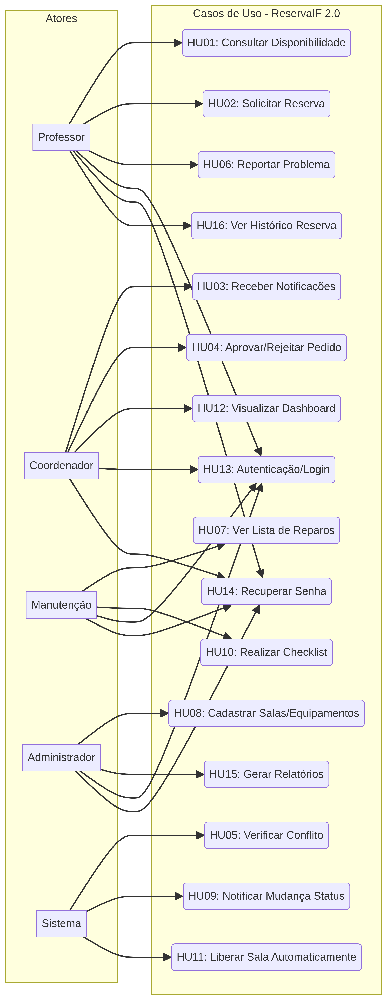
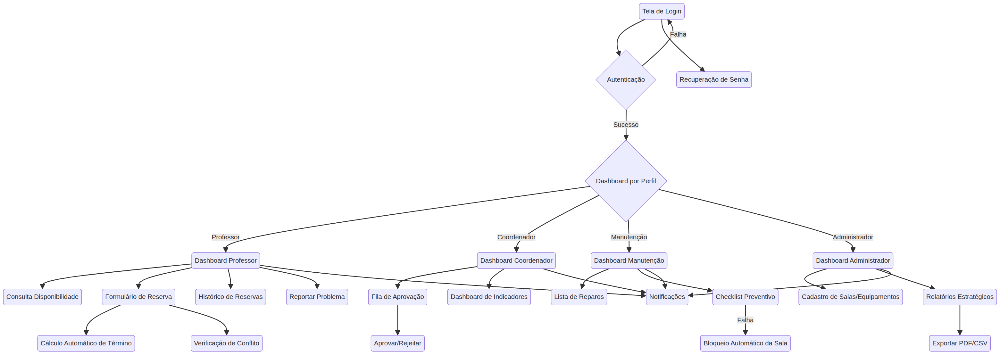
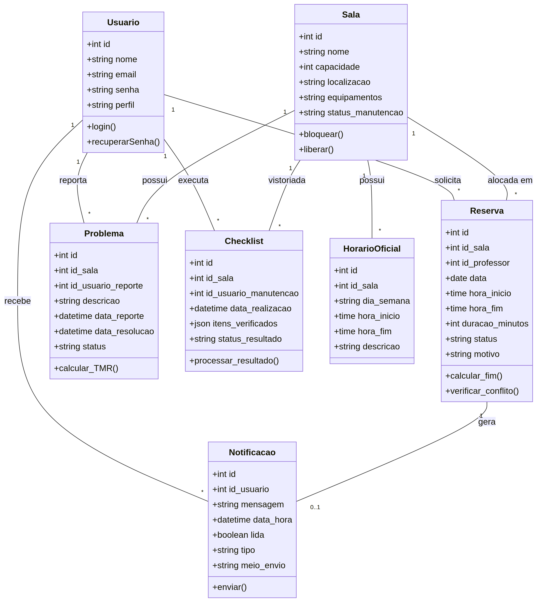
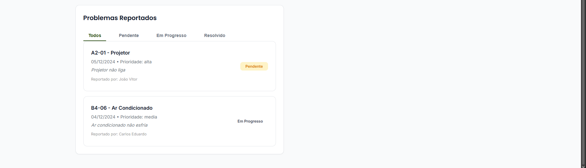
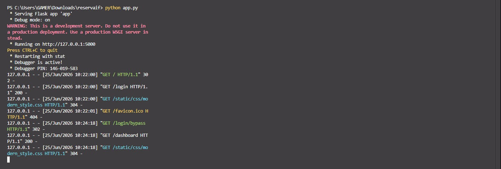
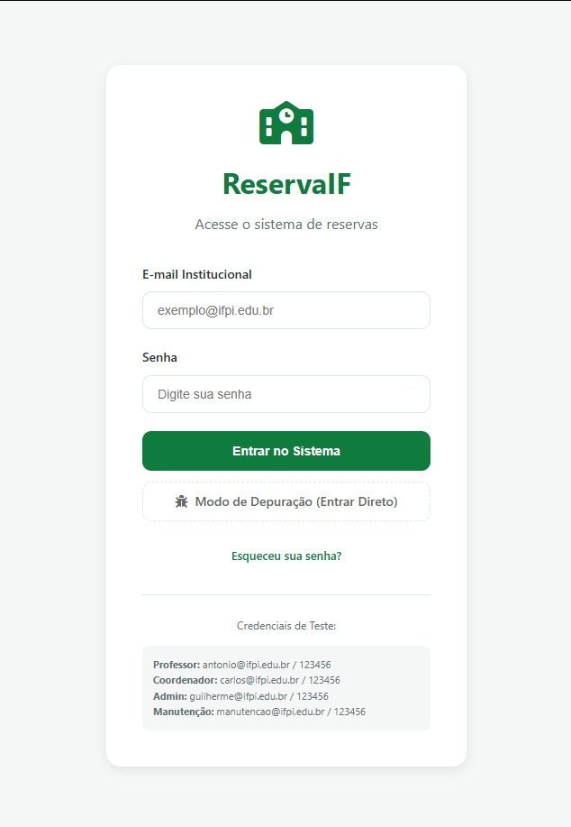
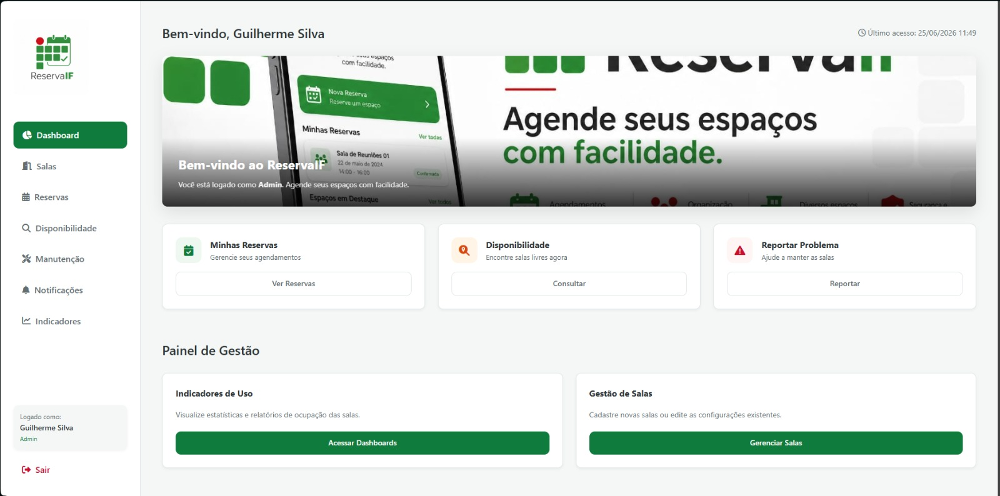
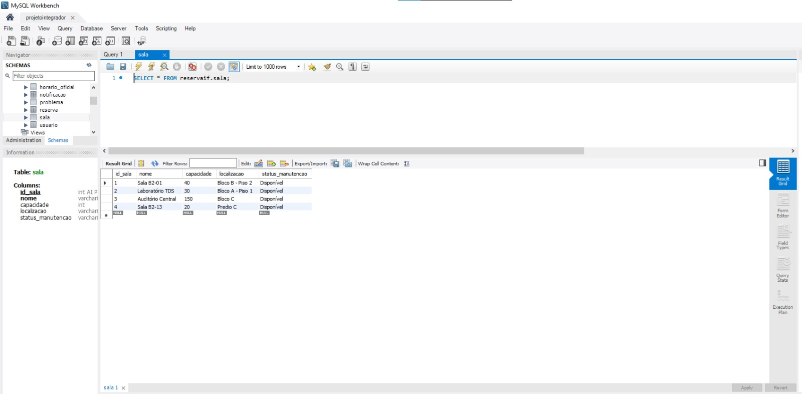
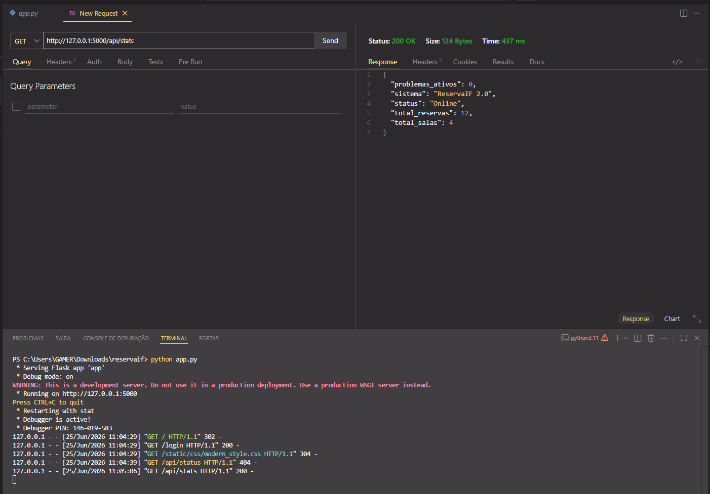

# ReservaIF 2.0
> Sistema centralizado para reservas de salas e recursos do IFPI.

---

# 1. Identificação do Projeto
## Equipe
- **Guilherme Silva** (Product Owner)
- **Carlos Eduardo Fernandes** (Scrum Master)
- **Allana Marina** (Desenvolvedora)
- **Antônio Marcos Pires** (Desenvolvedor)
- **Christian Souza** (Desenvolvedor)

## Disciplina
Projeto Integrador

## Professor
Ely Miranda

---

# 2. Problema a ser Resolvido
A falta de um sistema centralizado para reservas de salas, resultando em conflitos de agendamento, lentidão na gestão de aprovações e falta de informações sobre o estado das salas de aula.

---

# 3. Objetivo do Projeto
Otimizar a gestão de salas e recursos, garantindo um processo de reserva rápido, livre de conflitos e sob controle da Coordenação.

---

# 4. Público-Alvo
- Professores, Coordenação, Setor de Manutenção e Administração dos Institutos Federais.

---

# 5. Tecnologias Utilizadas
| Área | Tecnologia |
|:---:|:---|
| Front-end | HTML, CSS |
| Back-end | Flask, Python |
| Banco | MySQL Workbench |
| Prototipação | Figma |
| Gestão | Miro |

---

# 6. Requisitos do Sistema

# Atores 

* Professor
* Coordenador
* Manutenção
* Administrador
  
# Regras de Negócio

- Professor: pode consultar a disponibilidade de salas em um período, para evitar conflitos antes de reservar, pode preencher um formulário com cálculo automático de término, para submeter pedidos de reserva, quero que o sistema bloqueie reservas em horários de aulas regulares (Horário Oficial), pode reportar falhas (ex: projetor quebrado), para acionar a equipe de manutenção.

- Coordenador: recebe notificações imediatas (in-app/e-mail), para agir rapidamente sobre novos pedidos, tem acesso a uma interface para aprovar ou rejeitar pedidos, para controlar o uso das salas

- Manutenção: pode visualizar e filtrar problemas reportados, para agilizar os consertos, pode realizar checklists periódicos. Se um item falhar, a sala deve ser bloqueada automaticamente.

- Administrador: pode gerar relatórios de uso das salas para otimizar a distribuição de turmas.

# Backlog do Produto e Status de Entrega

| ID | Funcionalidade | Prioridade | Status |
|:---:|:---|:---:|:---:|
| **HU01** | Consulta de Disponibilidade | Alta | ✅ Concluído |
| **HU02** | Criação de Reserva (Cálculo de Término) | Crítica | ✅ Concluído |
| **HU03** | Notificação de Pedido (In-app/E-mail) | Crítica | ✅ Concluído |
| **HU04** | Gestão de Pedidos (Aprovação/Rejeição) | Crítica | ✅ Concluído |
| **HU05** | Verificação de Conflito (Horário Oficial) | Crítica | ✅ Concluído |
| **HU06** | Reporte de Problemas Técnicos | Alta | ✅ Concluído |
| **HU07** | Lista de Reparos para Manutenção | Média | ✅ Concluído |
| **HU08** | Cadastro de Salas e Equipamentos | Alta | ✅ Concluído |
| **HU09** | Notificações de Mudança de Status | Baixa | ✅ Concluído |
| **HU10** | Checklist Preventivo de Sala | Média | ✅ Concluído |
| **HU11** | Liberação Automática pós-uso | Critíco |✅ Concluído |
| **HU12** | Dashboard de Gestão (Indicadores) | Média | ✅ Concluído |
| **HU13** | Autenticação e Perfis de Acesso | Alta | ✅ Concluído |
| **HU14** | Recuperação de Senha | Baixa | ✅ Concluído |
| **HU15** | Relatórios Estratégicos de Uso | Baixa | ✅ Concluído |
| **HU16** | Histórico Detalhado da Reserva | Baixa | ✅ Concluído |

# Histórias de Usuário

---

## Gestão de Reservas (Core)
- **HU01:** Como **Professor**, quero **consultar a disponibilidade de salas**, para evitar conflitos de horário antes de solicitar uma reserva.
- **HU02:** Como **Professor**, quero **preencher um formulário de reserva**, para que o sistema calcule automaticamente o término e envie o pedido para análise.
- **HU03:** Como **Coordenador**, quero **receber notificações de novos pedidos**, para que eu possa agir rapidamente sobre as solicitações pendentes.
- **HU04:** Como **Coordenador**, quero **uma interface de aprovação/rejeição**, para controlar o uso dos espaços físicos da instituição.
- **HU05:** Como **Professor**, quero **que o sistema verifique o Horário Oficial**, para garantir que minha reserva não choque com aulas regulares.
- **HU11:** Como **Sistema**, quero **liberar a sala automaticamente após o uso**, para que a disponibilidade seja atualizada em tempo real.
- **HU16:** Como **Usuário**, quero **ver o histórico detalhado da reserva**, para saber quem aprovou e qual foi a justificativa em caso de rejeição.

## Manutenção e Infraestrutura
- **HU06:** Como **Professor**, quero **reportar falhas técnicas (ex: projetor quebrado)**, para que a equipe de manutenção seja acionada imediatamente.
- **HU07:** Como **Equipe de Manutenção**, quero **visualizar uma lista de reparos pendentes**, para organizar minha rotina de consertos.
- **HU08:** Como **Administrador**, quero **cadastrar salas e equipamentos**, para manter o inventário do campus atualizado no sistema.
- **HU10:** Como **Equipe de Manutenção**, quero **realizar checklists preventivos**, para garantir que as salas estejam em condições de uso antes das aulas.

## Segurança e Gestão
- **HU09:** Como **Usuário**, quero **receber alertas de mudança de status**, para ser informado assim que minha reserva for aprovada ou rejeitada.
- **HU12:** Como **Coordenador**, quero **visualizar um dashboard de indicadores**, para analisar a taxa de ocupação e o tempo médio de reparo das salas.
- **HU13:** Como **Usuário**, quero **acessar o sistema via login e senha**, para garantir que apenas pessoas autorizadas realizem reservas.
- **HU14:** Como **Usuário**, quero **recuperar minha senha via e-mail**, para que eu possa retomar o acesso caso a esqueça.
- **HU15:** Como **Administrador**, quero **gerar relatórios estratégicos**, para auxiliar a diretoria na tomada de decisão sobre expansão de recursos.

# 7. Modelagem do Sistema

## Diagrama de Casos de Uso


## Fluxo de Telas



## Arquitetura


## Modelo Entidade-Relacionamento


## Diagrama de Classes


# 8. Protótipos

## Tela de Login


## Dashboard





## Cadastro


# 9. Planejamento do Projeto

## Cronograma 
| Etapa | Período  |
|-------|----------|
| Levantamento | 26/04 a 26/04|
| Protótipos | 27/04 a 26/05 |
| Implementação | 27/05 a 28/06 |

## Sprints

| Sprints | Entregas |
|---------|----------|
| Sprint1 | Login + banco |
| Sprint2 | Dashboard |
| Sprint3 | Demais funcionalidades |
| Sprint4 | Relatórios |

## Gestão das Tarefas 


## Histórico de Entregas 
- Entrega 1: Documentação inicial do README, brainstorm de todas as ideias para o projeto e protótipos parciais de telas.
- Entrega 2: Continuação do código parcial e aprimoramento das HUs existentes.
- Entrega 3: Implementação parcial (cerca de 60% do escopo total do código) e revisão de erros na documentação.
- Entrega 4: Implementação final (código completo) e última revisão de erros no projeto todo.

---

# 10. Banco de Dados
 ## Estrutura

Arquivos disponíveis:

**database/ddl.sql:** Contém as instruções Data Definition Language (DDL), responsáveis pela criação da estrutura do banco de dados, incluindo tabelas, colunas, tipos de dados, chaves primárias, chaves estrangeiras e índices. Este arquivo define o esqueleto do banco de dados.

**database/dml.sql:** Contém as instruções Data Manipulation Language (DML), utilizadas para a manipulação dos dados, como inserção, atualização e exclusão de registros nas tabelas. É usado para popular ou modificar dados existentes.

**database/schema.sql:** Este arquivo integra as definições DDL e, opcionalmente, algumas instruções DML iniciais. Ele permite recriar o esquema completo do banco de dados a partir do zero, garantindo que a estrutura e os dados essenciais estejam prontos para uso. No contexto deste projeto, o schema.sql fornecido (pasted_content.txt) inclui tanto a criação das tabelas quanto a inserção de dados iniciais.

**database/seeds.sql:** Contém dados de semeadura (seed data), que são registros iniciais e de exemplo utilizados para testes e demonstrações do sistema. Estes dados permitem que o ambiente seja rapidamente configurado com informações básicas para validação das funcionalidades.

**database/modelo-er.png:** Uma representação visual do Modelo Entidade-Relacionamento (MER) do banco de dados. Este diagrama ilustra as entidades (tabelas), seus atributos (colunas) e os relacionamentos entre elas, facilitando a compreensão da arquitetura de dados do sistema.

 ## Modelo Visual 
  

 ## Observações
  
**Centralização de Usuários (USUARIO):** A tabela USUARIO centraliza todos os perfis de acesso (Administrador, Coordenador, Professor, Manutenção) com um campo perfil_acesso. Isso simplifica a gestão de autenticação (HU13) e permite que um único usuário possa ter diferentes papéis no sistema, facilitando a atribuição de responsabilidades (e.g., id_professor e id_coordenador_aprovacao na tabela RESERVA). O email é definido como UNIQUE para garantir a unicidade de cada usuário no sistema.

**Gestão Detalhada de Salas e Equipamentos (SALA, EQUIPAMENTO):** As tabelas SALA e EQUIPAMENTO permitem um controle dos recursos físicos. A SALA inclui capacidade, localizacao e status_manutencao, que é crucial para bloquear salas (HU10). EQUIPAMENTO é associado a SALA via chave estrangeira, permitindo o reporte de problemas específicos de equipamentos (HU06) e a manutenção do inventário (HU08).

**Processo de Reserva Abrangente (RESERVA):** A tabela RESERVA é o princípio do sistema, capturando todos os detalhes de uma solicitação. Inclui campos para data, hora_inicio, duracao_minutos e hora_fim (calculado), motivo, status_reserva (para controle do fluxo de aprovação/rejeição - HU04), justificativa_rejeicao e id_coordenador_aprovacao. Isso permite um registro completo do ciclo de vida da reserva, incluindo a auditoria de aprovações e rejeições (HU16).

**Horários Oficiais (HORARIO_OFICIAL):** A tabela HORARIO_OFICIAL foi criada para registrar os horários de aulas regulares por sala e dia da semana. Esta tabela é essencial para a verificação de conflitos (HU05), garantindo que as reservas não se sobreponham a atividades acadêmicas que já tenham sido definidas.

**Rastreamento de Problemas (PROBLEMA):** A tabela PROBLEMA permite que professores reportem falhas (HU06), registrando id_sala, id_equipamento (opcional), id_professor_reporte, descricao, data_reporte, status_problema e historico_status (JSON para rastrear mudanças de estado). Isso facilita a gestão e resolução de incidentes pela equipe de manutenção (HU07).

**Notificações Dinâmicas (NOTIFICACAO):** A tabela NOTIFICACAO armazena mensagens para usuários específicos (id_usuario), com tipo_notificacao, mensagem, data_hora, lida e meio_envio. Isso suporta o sistema de notificações (HU03, HU09), mantendo os usuários informados sobre o status de suas reservas e problemas reportados.

**Checklists de Manutenção (CHECKLIST):** A tabela CHECKLIST foi projetada para a equipe de manutenção realizar verificações preventivas (HU10). Registra id_sala, id_manutencao_responsavel, data_realizacao, status_checklist, itens_verificados (JSON para detalhes dos itens), e taxa_falha. A taxa de falha pode ser usada para acionar bloqueios automáticos de salas, conforme a regra de negócio.

---
# 11. Implementação

## 11. Implementação

O ReservaIF 2.0 utiliza uma arquitetura modular que separa a lógica de negócio da interface, garantindo um sistema escalável e de fácil manutenção.

### Backend
Desenvolvido em **Python com Flask**, o backend segue uma estrutura organizada em controladores e modelos:
- **Controladores (`controllers/`)**: Processam as requisições e gerenciam módulos como Reservas, Manutenção e Autenticação.
- **Modelos (`models/dados.py`)**: Encapsulam a lógica de acesso ao MySQL e definem as classes de domínio (`Sala`, `Reserva`, etc.).
- **Regras de Negócio**: Implementação de cálculos automáticos de término, verificação de conflitos de horário, bloqueio automático de salas por gravidade de problema e sistema de notificações in-app.

### Frontend
A interface foi construída com **HTML5, CSS3 e Jinja2**:
- **Template Base (`base.html`)**: Centraliza o layout, sidebar e navegação, garantindo consistência visual em todos os módulos.
- **Responsividade**: Estilização focada na identidade institucional, proporcionando uma experiência intuitiva para professores e coordenadores.

## Funcionalidades Concluídas
Todas as Histórias de Usuário (HUs) listadas no backlog foram implementadas e estão funcionais:

- **HU01 - Consulta de Disponibilidade** 
- **HU02 - Criação de Reserva (Cálculo de Término)**
- **HU03 - Notificação de Pedido (In-app/E-mail)**
- **HU04 - Gestão de Pedidos (Aprovação/Rejeição)**
- **HU05 - Verificação de Conflito (Horário Oficial)**
- **HU06 - Reporte de Problemas Técnicos** 
- **HU07 - Lista de Reparos para Manutenção** 
- **HU08 - Cadastro de Salas e Equipamentos** 
- **HU09 - Notificações de Mudança de Status** 
- **HU10 - Checklist Preventivo de Sala** 
- **HU11 - Liberação Automática pós-uso**
- **HU12 - Dashboard de Gestão (Indicadores)**
- **HU13 - Autenticação e Perfis de Acesso**
- **HU14 - Recuperação de Senha**
- **HU15 - Relatórios Estratégicos de Uso**
- **HU16 - Histórico Detalhado da Reserva**

---

# 12. Evidências do Projeto

## Sistema Rodando


## Tela Login Real


## Dashboard Implementado


## Banco Funcionando


## API Testada


## Demonstração
Inserir vídeo:
`docs/apresentacao/demo.mp4`
---

# 13. Como Executar o Projeto

Para executar o projeto localmente, siga os passos abaixo:

## Pré-requisitos
- **Python 3.x** instalado.
- **MySQL** instalado e em execução.
- **pip** (gerenciador de pacotes do Python).

## Configuração do Banco de Dados
1. Certifique-se de ter um servidor MySQL em execução.
2. Crie um banco de dados chamado `reservaif`.
3. Importe o esquema do banco de dados e os dados iniciais:
```bash
mysql -u seu_usuario -p reservaif < database/schema.sql
mysql -u seu_usuario -p reservaif < database/seeds.sql
```

## Configuração do Ambiente Python
1. Navegue até a pasta `backend` do projeto:
```bash
cd backend
```
2. Instale as dependências necessárias:
```bash
pip install -r requirements.txt
```

## Execução da Aplicação
1. Ainda dentro da pasta `backend`, inicie o servidor:
```bash
python app.py
```
2. O sistema estará disponível no seu navegador no endereço: [http://127.0.0.1:5000](http://127.0.0.1:5000 )

---

# 14. Próximos Passos
- **Testes de Estresse:** Validar o comportamento do sistema com múltiplas reservas simultâneas.
- **Documentação de API:** Criar uma documentação detalhada dos endpoints.
- **Refinamento de UI:** Ajustar detalhes visuais finais.
