# ReservaIF 2.0
> Sistema centralizado para reservas de salas e recursos do IFPI.

---

# 1. Identificação do Projeto
## Equipe
- **Guilherme Silva** (Product Owner)
- **Carlos Eduardo Fernandes** (Scrum Master)
- **Antônio Marcos Pires** (Desenvolvedor)
- **Christian Souza** (Desenvolvedor)
- **Lana Marina** (Desenvolvedora)

## Disciplina
Projeto Integrador

## Professor
Ely Miranda

---

# 2. Problema a ser Resolvido
A falta de um sistema centralizado para reservas de salas, resultando em conflitos de agendamento, lentidão na gestão de aprovações e falta de informações sobre o estado das salas de aula.

---

# 3. Objetivo do Projeto
Otimizar a gestão de salas e recursos, garantindo um processo de reserva rápido, livre de conflitos e sob controle da Coordenação.

---

# 4. Público-Alvo
- Professores, Coordenação, Setor de Manutenção e Administração dos Institutos Federais.

---

# 5. Tecnologias Utilizadas
| Área | Tecnologia |
|:---:|:---|
| Front-end | HTML, CSS |
| Back-end | Flask, Python |
| Banco | MySQL |
| Prototipação | Figma |
| Gestão | Miro |
-----------------------------

# 6. Requisitos do Sistema

# Atores 

* Professor
* Coordenador
* Manutenção
* Administrador
  
# Regras de Negócio

- Professor: pode consultar a disponibilidade de salas em um período, para evitar conflitos antes de reservar, pode preencher um formulário com cálculo automático de término, para submeter pedidos de reserva, quero que o sistema bloqueie reservas em horários de aulas regulares (Horário Oficial), pode reportar falhas (ex: projetor quebrado), para acionar a equipe de manutenção.

- Coordenador: recebe notificações imediatas (in-app/e-mail), para agir rapidamente sobre novos pedidos, tem acesso a uma interface para aprovar ou rejeitar pedidos, para controlar o uso das salas

- Manutenção: pode visualizar e filtrar problemas reportados, para agilizar os consertos, pode realizar checklists periódicos. Se um item falhar, a sala deve ser bloqueada automaticamente.

- Administrador: pode gerar relatórios de uso das salas para otimizar a distribuição de turmas.

# Backlog do Produto e Status de Entrega

| ID | Funcionalidade | Prioridade | Status |
|:---:|:---|:---:|:---:|
| **HU01** | Consulta de Disponibilidade | Alta | Planejado |
| **HU02** | Criação de Reserva (Cálculo de Término) | Crítica | ✅ Concluído |
| **HU03** | Notificação de Pedido (In-app/E-mail) | Crítica | Em breve |
| **HU04** | Gestão de Pedidos (Aprovação/Rejeição) | Crítica | ✅ Concluído |
| **HU05** | Verificação de Conflito (Horário Oficial) | Crítica | Em breve |
| **HU06** | Reporte de Problemas Técnicos | Alta | ✅ Concluído |
| **HU07** | Lista de Reparos para Manutenção | Média | Planejado |
| **HU08** | Cadastro de Salas e Equipamentos | Alta | ✅ Concluído |
| **HU09** | Notificações de Mudança de Status | Baixa | ✅ Concluído |
| **HU10** | Checklist Preventivo de Sala | Média | ✅ Concluído |
| **HU11** | Liberação Automática pós-uso | Critíco |✅ Concluído |
| **HU12** | Dashboard de Gestão (Indicadores) | Média | Planejado |
| **HU13** | Autenticação e Perfis de Acesso | Alta | Planejado |
| **HU14** | Recuperação de Senha | Baixa | Planejado |
| **HU15** | Relatórios Estratégicos de Uso | Baixa | Planejado |
| **HU16** | Histórico Detalhado da Reserva | Baixa | Planejado |

# Histórias de Usuário

---

## Gestão de Reservas (Core)
- **HU01:** Como **Professor**, quero **consultar a disponibilidade de salas**, para evitar conflitos de horário antes de solicitar uma reserva.
- **HU02:** Como **Professor**, quero **preencher um formulário de reserva**, para que o sistema calcule automaticamente o término e envie o pedido para análise.
- **HU03:** Como **Coordenador**, quero **receber notificações de novos pedidos**, para que eu possa agir rapidamente sobre as solicitações pendentes.
- **HU04:** Como **Coordenador**, quero **uma interface de aprovação/rejeição**, para controlar o uso dos espaços físicos da instituição.
- **HU05:** Como **Professor**, quero **que o sistema verifique o Horário Oficial**, para garantir que minha reserva não choque com aulas regulares.
- **HU11:** Como **Sistema**, quero **liberar a sala automaticamente após o uso**, para que a disponibilidade seja atualizada em tempo real.
- **HU16:** Como **Usuário**, quero **ver o histórico detalhado da reserva**, para saber quem aprovou e qual foi a justificativa em caso de rejeição.

## Manutenção e Infraestrutura
- **HU06:** Como **Professor**, quero **reportar falhas técnicas (ex: projetor quebrado)**, para que a equipe de manutenção seja acionada imediatamente.
- **HU07:** Como **Equipe de Manutenção**, quero **visualizar uma lista de reparos pendentes**, para organizar minha rotina de consertos.
- **HU08:** Como **Administrador**, quero **cadastrar salas e equipamentos**, para manter o inventário do campus atualizado no sistema.
- **HU10:** Como **Equipe de Manutenção**, quero **realizar checklists preventivos**, para garantir que as salas estejam em condições de uso antes das aulas.

## Segurança e Gestão
- **HU12:** Como **Coordenador**, quero **visualizar um dashboard de indicadores**, para analisar a taxa de ocupação e o tempo médio de reparo das salas.
- **HU13:** Como **Usuário**, quero **acessar o sistema via login e senha**, para garantir que apenas pessoas autorizadas realizem reservas.
- **HU14:** Como **Usuário**, quero **recuperar minha senha via e-mail**, para que eu possa retomar o acesso caso a esqueça.
- **HU15:** Como **Administrador**, quero **gerar relatórios estratégicos**, para auxiliar a diretoria na tomada de decisão sobre expansão de recursos.
- **HU09:** Como **Usuário**, quero **receber alertas de mudança de status**, para ser informado assim que minha reserva for aprovada ou rejeitada.

# 7. Modelagem do Sistema

## Diagrama de Casos de Uso

## Fluxo de Telas
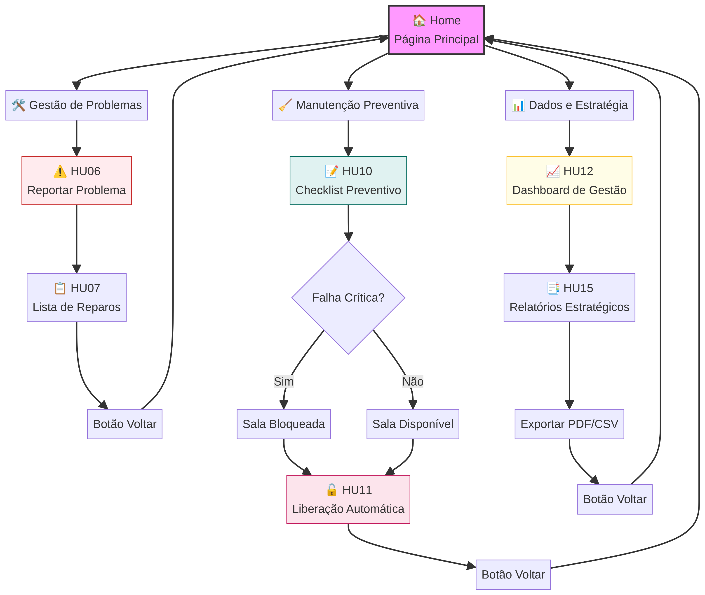
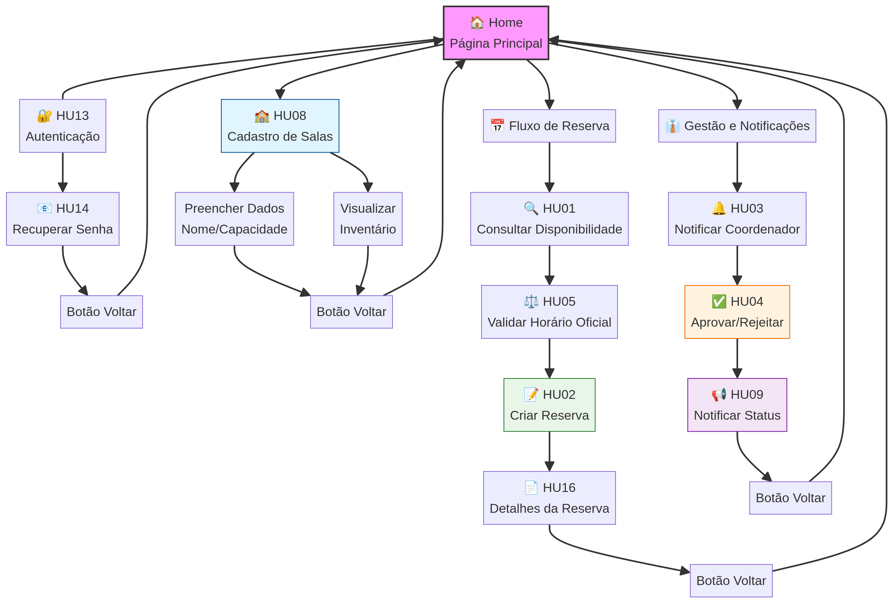

## Arquitetura
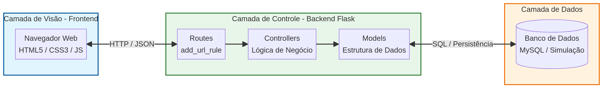

## Modelo Entidade-Relacionamento

## Diagrama de Classes
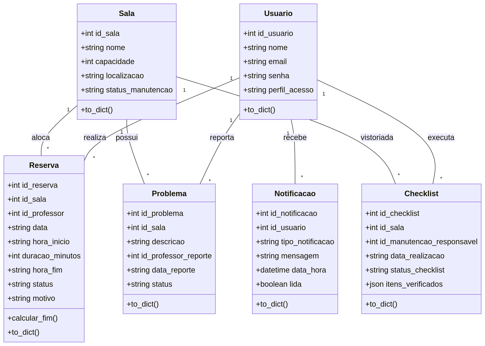

# 8. Protótipos

## Tela de Login
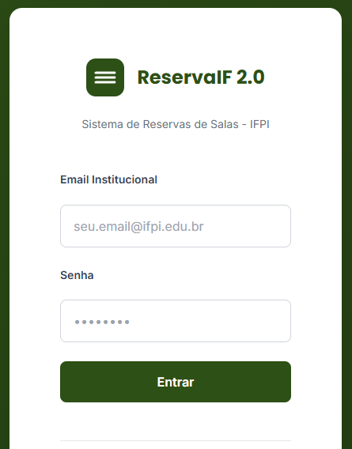

## Dashboard
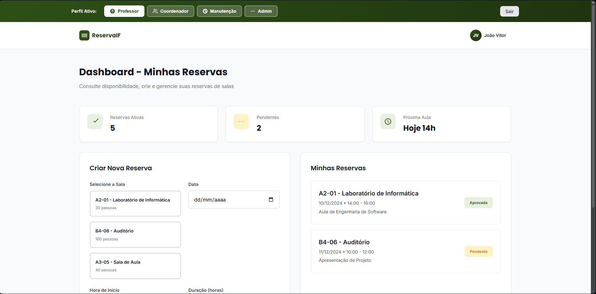
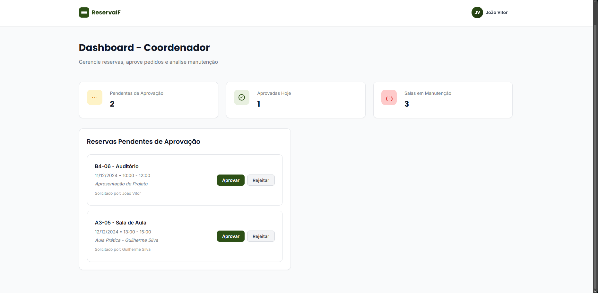
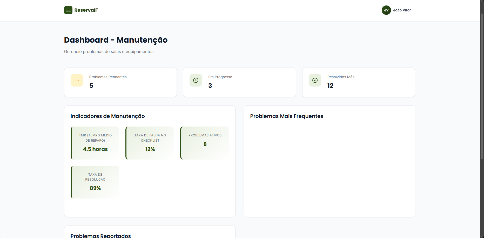

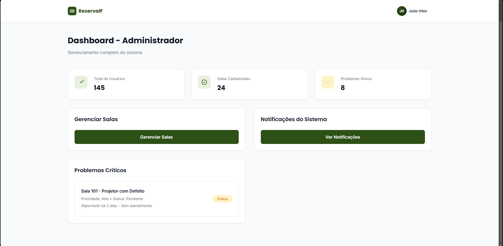

## Cadastro
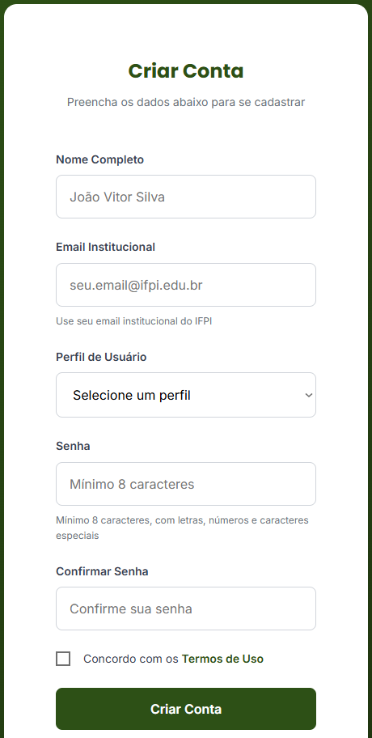

# 9. Planejamento do Projeto

## Cronograma 
| Etapa | Período  |
|-------|----------|
| Levantamento | 25/04 a 26/04|
| Protótipos | 26/04 a 26/05 |
| Implementação | 25/05 a 26/05 |

## Sprints

| Sprints | Entregas |
|---------|----------|
| Sprint1 | Login + banco |
| Sprint2 | Dashboard |
| Sprint3 | Relatórios |

## Gestão das Tarefas 
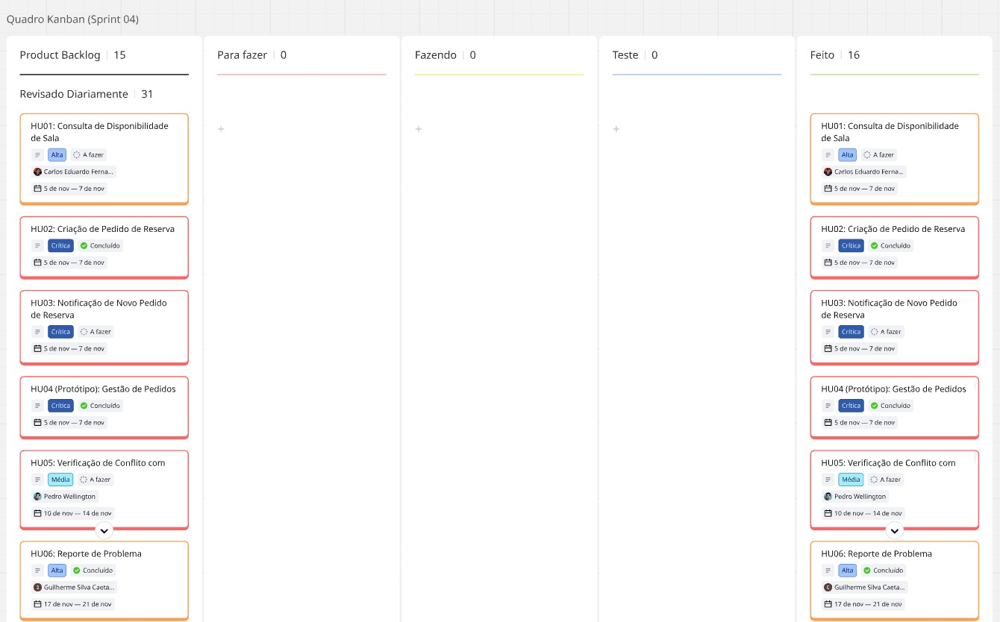
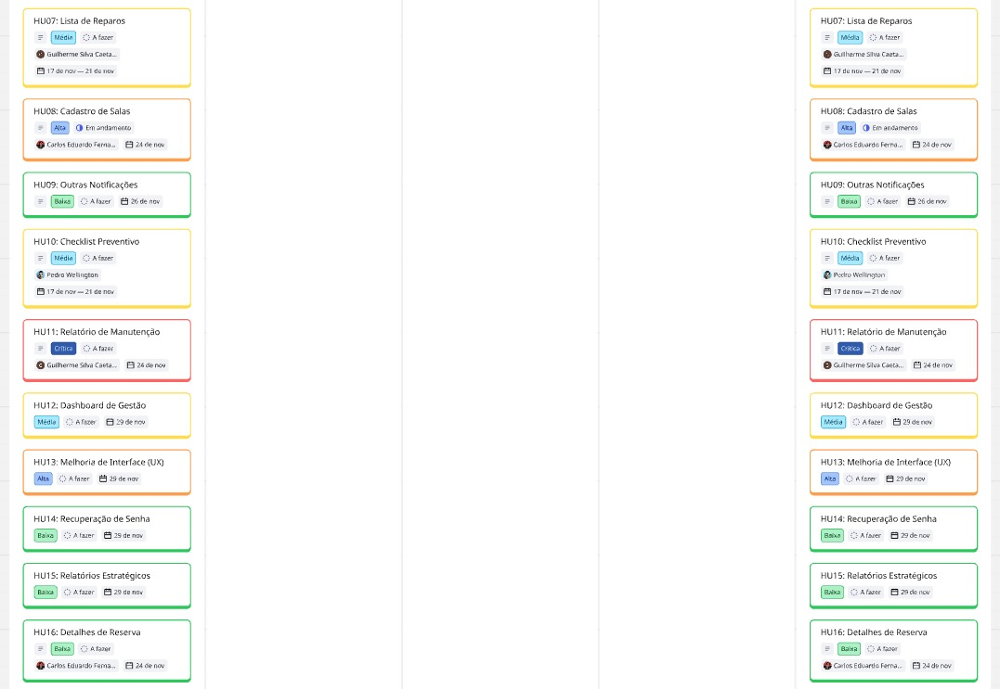

## Histórico de Entregas 
- Entrega 1: Documentação inicial
- Entrega 2: Protótipos
- Entrega 3: Implementação parcial
---

# 10. Banco de Dados
 ## Estrutura

 Arquivos disponíveis:
 -'database/ddl.sql'
 -'database/dml.sql'
 -'database/schema.sql'
 -'database/seeds.sql'
 
 ## modelo visual 
  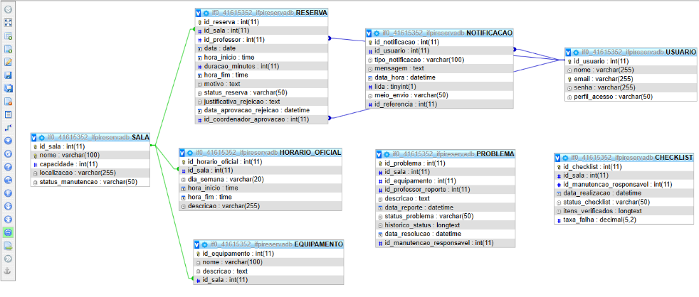

  ## Observações
  
  Descrever decisões tomadas na modelagem
---
# 11. Implementação

## Backend
O backend foi desenvolvido em **Python com o framework Flask**, seguindo uma estrutura modular e organizada:
- **Arquitetura:** Padrão MVC (Model-View-Controller) com roteamento manual e explícito via `add_url_rule`.
- **Rotas:** Centralizadas no arquivo `routes/routes.py` para facilitar a manutenção e o controle de endpoints.
- **Regras de Negócio:** Implementação de lógica para cálculo automático de término de reserva (HU02), bloqueio automático de salas via checklist (HU10) e sistema de notificações reativo (HU09).

## Frontend
As interfaces foram construídas com **HTML5 e CSS3**, utilizando a identidade visual institucional (Branco e Verde):
- **Dashboard Principal:** Central de navegação para todos os perfis de usuário.
- **Módulo de Salas:** Interfaces para listagem e formulário de cadastro de novos recursos.
- **Módulo de Reservas:** Tela de solicitação com campos dinâmicos e visualização de status.
- **Módulo de Manutenção:** Telas para reporte de falhas técnicas e realização de checklists preventivos.

## Funcionalidades Concluídas
- **HU08 - Cadastro de Salas:** Inventário completo de recursos e equipamentos.
- **HU02 - Solicitação de Reserva:** Fluxo de pedido com cálculo automático de horário.
- **HU04 - Gestão de Pedidos:** Interface para aprovação e rejeição por parte da coordenação.
- **HU06 - Reporte de Problemas:** Sistema de alerta para falhas técnicas nas salas.
- **HU09 - Notificações:** Alertas automáticos de mudança de status para os usuários.
- **HU10 - Checklist Preventivo:** Vistoria técnica com regra de bloqueio automático de salas.
- **HU11 - Liberação Automática:** Funcionalidade de reset de status pós-uso.

## Funcionalidades em Desenvolvimento
- **Relatórios Estratégicos:** Geração de documentos em PDF/CSV sobre o uso das salas (HU15).
- **Painel Administrativo Avançado:** Gestão de usuários, perfis de acesso e recuperação de senha (HU13/14).
- **Dashboard de Gestão:** Gráficos de indicadores de desempenho e ocupação (HU12).

## Funcionalidades Concluídas 

- Criação de pedido de reserva
- Gestão de pedido
- Reporte de problema
- Cadastro de salas
- Outras notificações
- Checklist preventivo
- Relatório de manutenção

## Funcionalidades em Desenvolvimento
- Relatórios
- Painel administrativo
- Consulta de disponibilidade
- Lista de reparos
- Notificação de reparos
- Notificação de status
- Liberação automática
- Dashboard de gestão
- Autenticação (segurança)
- Recuperação de senha
- Relatórios estratégicos
- Detalhes de reserva (melhoria)

# 12. Evidências do Projeto

Justificativa p/ausência: Sobre essa parte, como já dito nas outras seções faltando, o código ainda está em processo de revisão. Os testes ainda vão ser feitos para que possamos adicionar todas as evidências de que tudo está funcionando nos conformes. Então por enquanto, vamos deixar essa parte vazia até garantir que o código está 100% funcional. Já que essa parte da apresentação é o final, então o prazo previsto é o mais longo possível (01/06, com altas chances de alteração). Essa parte é responsabilidade de todos (Antônio Marcos, Cristian e Lana no desenvolvimento direto; Carlos Eduardo e Guilherme na revisão).

# 13. Itens Ainda Não Produzidos

### Código-Fonte, Evidências, Apresentação, Assets e Src
O repositório está sendo estruturado. A codificação iniciará após a validação dos protótipos.
**Previsão:** Sprint 3.

# 14. Como Executar o Projeto

Os códigos de execução ainda estão vazios porque o código principal ainda está em desenvolvimento e queremos garantir que tudo esteja em funcionamento completo. O prazo previsto é dia 26/05, para que haja tempo para que as demais coisas sejam feitas. Os responsáveis são todos da equipe, já que o código é conjunto.
